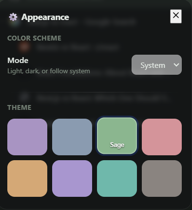

# ZenTree Tabs

  
  <h3>Vertical Tree-Style Tab Manager for Chrome</h3>
  
Minimalist. Tree-Style. Native.

  

    <a href="https://shuknuk.github.io/zentreeTabs/"><strong>Official Website</strong></a> | 
    <a href="https://zentreetabs.vercel.app/"><strong>Vercel Mirror</strong></a>
  

 

No one has time to switch browsers, because they're too reliant on them *cough Chrome. 

But even those browsers that feature vertical tabs, they don't present them properly. They should be in a tree-style tab, knowing from which main tab other tabs have came from. It becomes so much easier to track that way. 

Which is why I build this: tabs in a vertical layout, nested like branches in a tree. All without switching web browers. 

**ZenTree Tabs**

**ZenTree Tabs** brings vertical, tree-style browsing to the Chrome Side Panel. 

I built this because I wanted the organizational flow and aesthetic of browsers like Arc, but without leaving the Chrome ecosystem. It features automatic nesting, full support for native Tab Groups, and a clean, glassmorphic UI.

## Demo

  

## Features

- **Tree Layout**: Tabs automatically nest under the tab they were opened from, keeping your research context linked naturally.
  

    
  

- **Native Group Sync**: Chrome Tab Groups show up as folders. Collapsing a folder in the sidebar collapses the actual group in the top strip (and vice versa).
- **Drag & Drop**: Smooth HTML5 drag-and-drop to reorder tabs or change the nesting hierarchy. You can also drag tabs directly into Group Headers.
- **Multi-Select**: Use `Ctrl/Cmd + Click` or `Shift + Click` to select multiple tabs for batch closing or grouping.
- **Tab Visit Order (Back / Forward)**: Left and right arrow buttons next to the search options let you step through tabs by **viewing order** (like VS Code’s tab arrows). History is per-window by default and persisted in session storage. Optional **“Nav across windows”** lets back/forward step through tabs in all windows (focus follows to the other window).
- **Enhanced Context Menu**: Right-click any tab for quick actions:
  - **New tab as child** – open a new tab nested under this one
  - **Move next to current tab** – move this tab right after the active tab (works across windows)
  - **Make child of current tab** – nest this tab under the active tab (works across windows)
  - **Move to current window** – in search results, move a tab from another window into the current window
  - Duplicate, reload, mute/unmute, rename, promote from nest, close
  - Smart edge detection keeps the menu on screen
- **Search & Close in Search**: Search across the current window, all windows, or include bookmarks. A **clear (X)** button appears in the search box when there’s text so you can reset with one click. Each tab row in search results has a visible **close (X)** button; closing removes only that tab and keeps you in search. Right-click in search for “Move to current window” on tabs from other windows.
- **Narrow Panel**: Layout uses `min-width: 0` so you can drag the side panel as narrow as Chrome’s minimum (~360px) without the UI forcing a wider width.

- **AI Semantic Grouping (Beta)**: Local AI assistant that understands your research context.
  - **Smart Clustering**: Uses the `all-MiniLM-L6-v2` model to group related tabs across different domains.
  - **Deterministic Labeling**: Generates concise, predictable group names (e.g., "Cookie Research").
  - **Configurable Threshold**: Set minimum tabs (2-5) before auto-grouping same domains.
  - **100% Local**: No API keys, no tracking. Everything runs on your device via WASM.
- **Theming**:
  - Comes with 9 themes: Cream (Default), Mist, Sage, Blush, Sand, Lavendar, Seaform, Stone, and AMOLED
  - AMOLED theme features pure black background optimized for OLED displays
  - Toggles for "Background Mesh" and "Glassy Tabs" to tweak the look.
  

    
  

- **Smart Icons**: Handles system icons (Settings, History) and Extension pages correctly, so you don't get broken favicons.

## Installation

The extension is now available on the **Chrome Web Store**:

[**Get ZenTree Tabs on Chrome Web Store**](https://chromewebstore.google.com/detail/oehbeeknkkjggpkojibjhmkklgodpdbd?utm_source=item-share-cb)

> [!NOTE]  
> The current store version is **v2.1.0**.  
> **v3.1** (with local AI grouping, AMOLED theme, configurable thresholds, and enhanced context menu) is currently pending review and is coming soon!

### Manual Installation (Developer Mode)

If you'd like to try out the upcoming features before they hit the store:

## Good to Know

- **New Tabs**: Manually opening a new tab (`Cmd/Ctrl + T`) will always start at the root level to prevent accidental nesting chains.
- **Renaming**: Custom names are stored in local storage, so they won't mess with the actual page title or SEO.
- **Selection**: `Ctrl/Cmd + A` works to select all tabs if you need to clear your workspace quickly.

## Tech Stack

- **AI Infrastructure**: `Transformers.js` + `all-MiniLM-L6-v2` for on-device semantic reasoning.
- **WASM**: WebAssembly for high-performance local inference.
- **Core**: Vanilla JavaScript (ES6+), CSS3, and HTML5.
- **Manifest**: Chrome Extension Manifest V3.
- **Storage**: `chrome.storage.local` to persist tab groupings and custom names.

## License

[MIT](LICENSE)
